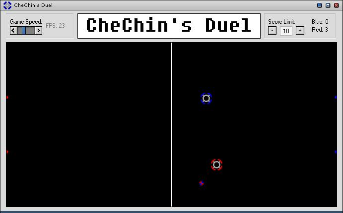



## CheChin's Duel

### Description

A lil' game where you play against an AI, while you trie your hardets to get that *** ball into his goal :)
 
### More Info
 

             |
---                |---
**Submitted On**   |2003-12-25 18:25:42
**By**             |[Jannik F\. Kokkvoll](https://github.com/Planet-Source-Code/PSCIndex/blob/master/ByAuthor/jannik-f-kokkvoll.md)
**Level**          |Intermediate
**User Rating**    |5.0 (15 globes from 3 users)
**Compatibility**  |VB 5\.0, VB 6\.0
**Category**       |[Games](https://github.com/Planet-Source-Code/PSCIndex/blob/master/ByCategory/games__1-38.md)
**World**          |[Visual Basic](https://github.com/Planet-Source-Code/PSCIndex/blob/master/ByWorld/visual-basic.md)
**Archive File**   |[CheChin's\_16868412262003\.zip](https://github.com/Planet-Source-Code/jannik-f-kokkvoll-chechin-s-duel__1-50608/archive/master.zip)

### API Declarations

there are some, sure... mostly gfx related.

